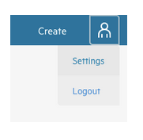
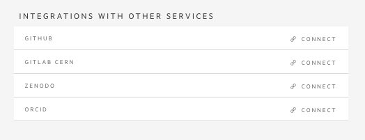

## Connecting CAP with Git repositories

We have already created a new CAP entry, added some metadata (datasets, triggers information) and uploaded files. Now it's time to tell us, where is the code that you used in your analysis.

It is possible to connect an external account (Github, CERN Gitlab, ORCiD, Zenodo. . . ) with the CAP account, to automate tasks and content submission. One can just add the current repository content from the tarball or create a connection (webhook) so that everytime
something is changed, the CAP is automatically updated. Let's try it out using your CERN Gitlab account!

In general, if you want to connect a public repository, you don't need to connect your account. CERN Gitlab is an exception, as
even public repositories require a CERN authentication. So let's first connect your account.

1.  Open CAP in a new tab
2.  Click on your account icon and go to `Settings`

    

3.  Choose `+ CONNECT` next to `GITLAB CERN` and connect your account

    

Now let's go back to your open analysis in the previous tab:

1.  Go to the menu on your left and click on the connection symbol (third icon)
2.  Right now you should see no repositories connected with your analysis
3.  To change it you can use repository created specially for this workshop or one of your own Gitlab repositories

```
https://gitlab.cern.ch/awesome-workshop/payload-cap-cms
```

4.  We have two options:

    

    - download - like downloading a file - it will make a snapshot of a repo at this moment and attach it to your analysis files (you will find it with other files in your `File Manager`). Use this option for repositories that you use, but not maintain or when your analysis code is already in its final state.
    - connect - create a link between your repository and analysis. This way you can keep your analysis up to date with your code changes - we will make a snapshot of each new version of your code and attach it to your analysis for you. It's recommended for analysis that are still in progress.

5.  Let's pick `CONNECT`.
6.  Connecting a repository is an asynchronous task, hence it requires you to refresh your page (we're sorry, this is still BETA, we'll make it much better soon!)
7.  Check if you can see connected repo in your `Connected Repositories` list

    

8.  Go to your `File Manager` and download the snapshot

    

9.  Now you can try to push some changes in the repo (or if you picked our workshop repository wait for teacher to make a new commit)
10. Refresh your page
11. In `Connected Repositories` find your repo and click on an arrow on the right side - you can see a new snapshot there

    

12. Go to `File Manager` and download your updated repository. Can you see new changes?
